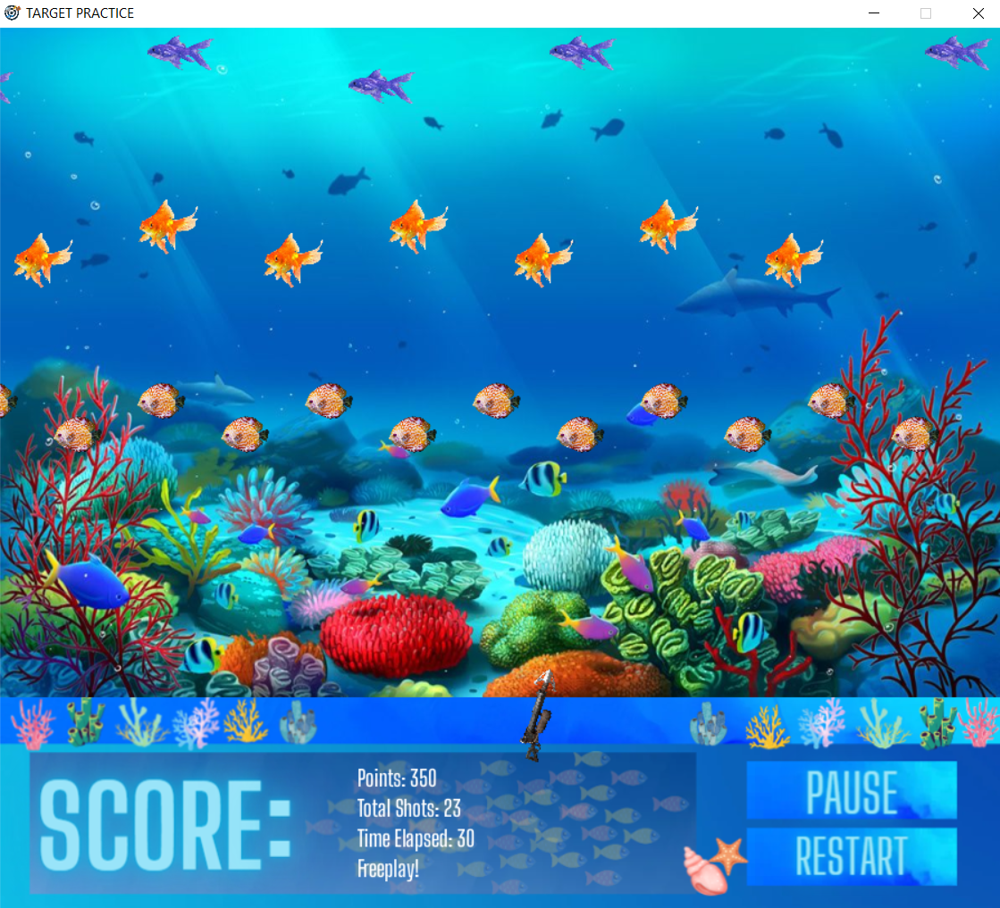

# Target Practice - Collaborative Arcade Shooting Game

## Overview
"Target Practice" stands as an exceptional arcade shooting gallery game developed collaboratively by a skilled and dedicated team of developers using the Python programming language and the Pygame library. This project not only showcases technical proficiency but also highlights the cohesive teamwork and innovative spirit that brought it to life.The game design (menus, banners, icons, elements) was created in Canva and Adobe Photoshop.

## Team Dynamics

- **Collaborative Spirit:**
  - The team demonstrated strong collaboration, pooling diverse skills to address different aspects of the project.

- **Effective Communication:**
  - Clear and effective communication within the team ensured smooth coordination and timely completion of tasks.

- **Problem-Solving Skills:**
  - The team showcased excellent problem-solving skills, overcoming challenges during development with creativity and perseverance.

- **Adaptability:**
  - The ability to adapt to changing requirements and incorporate feedback reflects the team's flexibility and commitment to continuous improvement.

## Key Features:

1. **Innovative Gameplay Design:**
   - The game features multiple engaging modes, offering players a diverse and entertaining shooting experience.
   - Creative and challenging target designs were implemented, showcasing the team's innovative approach to gameplay.

2. **Interactive User Interface:**
   - User-friendly menus and interfaces were carefully designed for seamless navigation, enhancing the overall user experience.
   - Intuitive controls ensure players can quickly dive into the game and enjoy the shooting challenges.

3. **Dynamic Visuals and Sound:**
   - The team crafted visually appealing backgrounds that dynamically change with each level, adding a layer of immersion.
   - Immersive sound effects were meticulously selected to complement the gaming experience.

4. **Scalable Difficulty Levels:**
   - The inclusion of three difficulty levels demonstrates the team's commitment to providing a game suitable for players of all skill levels.
   - Targets dynamically change in size and movement patterns, ensuring an adaptive and challenging experience.

5. **High Score System:**
   - The implementation of a persistent high score system reflects the team's focus on creating a competitive and replayable game.
   - Players can compete against themselves and challenge friends, fostering a sense of friendly competition.

6. **Responsive Controls:**
   - The team prioritized responsive controls, optimizing mouse interactions for precise aiming and shooting.
   - Interactive gun mechanics add realism and engagement to the gameplay.
  
7. **Team Collaboration:**
   - Developed collaboratively by a passionate and talented team of developers.
   - Each team member brought unique skills, contributing to the game's overall success.

## Installation
- The game can be easily launched by running the .exe file, providing players with quick access to an immersive shooting experience.

## Game Screenshots
-Images for all levels

### Level 1

  

### Level 2

  

### Level 3

  

-Game Over menu:

  

-Main menu with different options:

  

